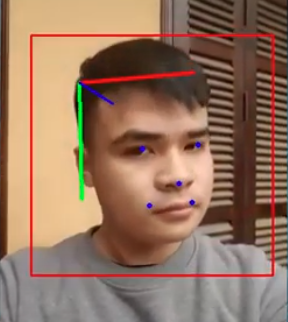

# Deep Head Pose 2 - Keras Tensorflow 2

[](https://www.youtube.com/watch?v=SNHnsuNkBkQ)

## I. Introduction

- Human keypoint detection.

## II. Environment:

- We use Tensorflow 2.0.0.
- Install environment from `environment.yml` file using Anaconda and Miniconda and activate that environment.

## III. Training and testing

### Training

- Modify config files at `config_shufflenetv2.json` and `config_efficientnet.json` to use for training and testing.

- Example of commands for training:

```
python train.py -c config_shufflenetv2.json
```

Or 

```
python train.py -c config_efficientnet.json
```

### Testing

```
python test.py -c config_shufflenetv2.json
```

Or 

```
python test.py -c config_efficientnet.json
```


### References

- MPII dataset to json: https://raw.githubusercontent.com/mitmul/deeppose/master/datasets/mpii_dataset.py.